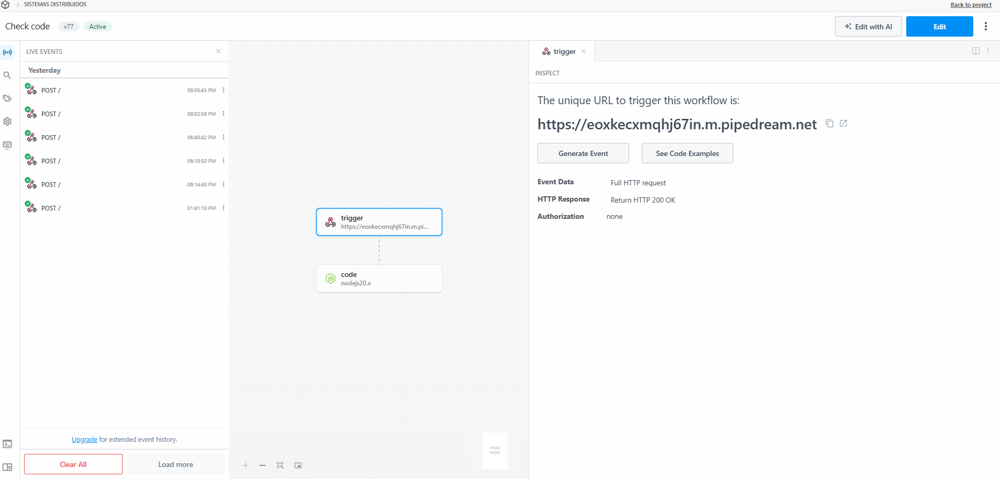
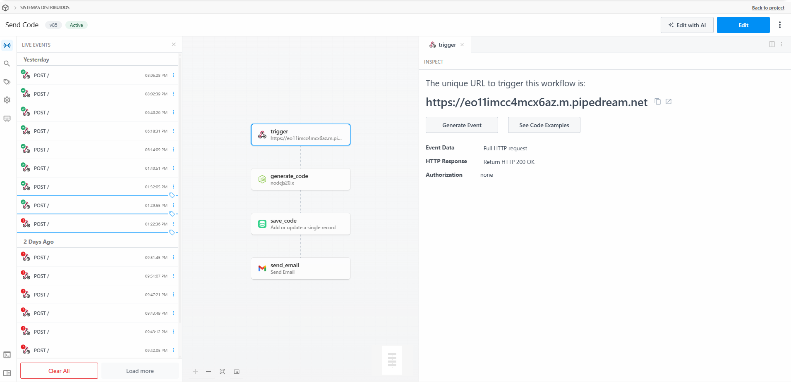

# Proyecto Sistemas Distribuidos

Sistema de gestión de inventario basado en arquitectura de microservicios.

## 📂 Estructura del Proyecto

El sistema está dividido en cuatro directorios principales, cada uno funcionando como un servicio independiente:

### 1. `Frontend-angular` (Interfaz de Usuario)
Contiene la lógica visual y de cliente.
* **Función:** Consume las APIs de los dos backends, gestiona la sesión del usuario y unifica la información visualmente.

### 2. `Backend-node` (Servicio de Autenticación)
Microservicio encargado de la seguridad y los usuarios.
* **Tecnologías:** Node.js, Express, TypeScript, MySQL.
* **Función:** Gestiona el registro, login, generación de Tokens JWT y muestra la lista de usuarios de quien creo el producto.

### 3. `Backend-php` (Servicio de Productos)
Microservicio encargado del inventario puro.
* **Tecnologías:** PHP 8, PostgreSQL.
* **Función:** Es un CRUD de productos.

### 4. `Integracion-Pipedream` (Servicio de Notificaciones)
Microservicio para el manejo de eventos asíncronos y seguridad.
* **Tecnologías:** Pipedream, .NET.
* **Función:** Gestiona el envío de correos,  el **envío del código de recuperación de contraseña** al correo del usuario y la **verificación** posterior del código para autorizar el cambio de contraseña.
  
# Mis Flujos de Pipedream

### Check Code

  

### Send Code

  

